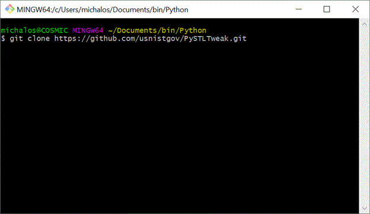
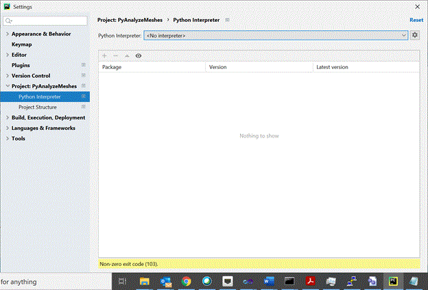
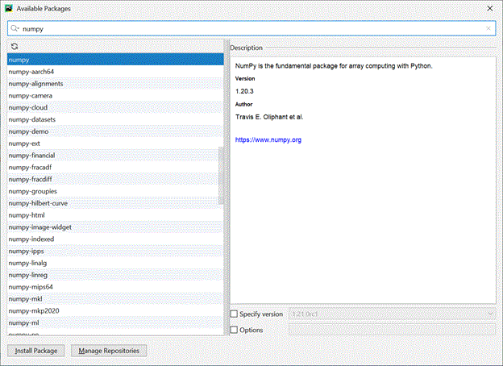
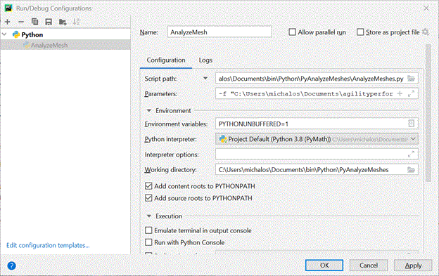

# PySTLTweak
----

# INSTALLATION

(Assumes installation of Windows github GUI tools – use Git Bash on windows below).

1. Clone PySTLTweak



2. Install jetbrains pycharm (or Python IDE of your choice) Instructions below are for PyCharm community.

3. Bring up PyCharm, click File->settings scroll down to Project



4. Click gear box to add python interpreter: 

	- Choose Virtualenv Environment (loads Python interpreter locally NOT windows)

	- Select latest and click ok

	- Wait a while for it to install interpreter and base modules

	- Now add modules – click the [+] button and you should see this popup dialogue:



		- Put numpy in the search bar and press magnifying glass and click Install Package

		- Put numpy-stl in the search bar and press magnifying glass and click Install Package This is the major STL mesh analysis library. We just wrap it.

		- Click X to exit [+] and Ok to exit Setttings

## DEBUGGING

To debug the program: Click run->debug then select PyAnalyseMesh

NOTE YOU WILL NEED TO MODIFY YOUR DEBUG command line arguments

- Menu   Run->Edit configurations  will get you pop up.



Under parameters

-s 2.0 -i "C:\Users\michalos\Documents\agilityperformancemetrics\TaskBoard\STL\taskboard-pegarray1-1_Centered_ZeroZmin.stl"

Put in an STL file from the folder under your github repository. Note -s 2.0 tells is to scale. -I is the input file.



## Using Bash script 

Install github on Windows and use its bash here when you right click on a folder.

In the folder PyAnalyzeMeshes/bin is a bash script to run Python to analyze and make minor changes to STL meshes.   It will automatically generate a mesh analysis report containing volume, COG, Inertial Frame, and min/max xyz. For gears I tried to center and translate the mesh so that the minimum z is 0, and when this is done it automatically generates a new file name with "_Centered"or "_ZeroZmin" or "_ZeroZmax" or "_Rotate" axes appended to original file name.

 





AnalyzeMeshes.py use stl-mesh python library to tweak STL files:



usage: AnalyzeMeshes.py [-h] [-v] [-c] [-maxz] [-minz] [-p PATTERN]

[-i INPUTFILE] [-o OUTPUTFILE] [-f FOLDER] [-rx ROTX]

[-ry ROTY] [-rz ROTZ] [-tx TRANSX] [-ty TRANSY]

[-tz TRANSZ] [-sx SCALEX] [-sy SCALEY] [-sz SCALEZ]



optional arguments:

-h, --help     show this help message and exit

-v, --verbose  increase output verbosity

-c, --center   center mesh around (0,0,0) origin

-maxz, --maxz  maximum z at (0,0,0) origin

-minz, --minz  minimum z at (0,0,0) origin

-p PATTERN     regex pattern for matching file

-i INPUTFILE   input file name

-o OUTPUTFILE  output file name

-f FOLDER      base file folder

-rx ROTX       rotation around X angle in degrees

-ry ROTY       rotation around Y angle in degrees

-rz ROTZ       rotation around Z angle in degrees

-tx TRANSX     translation along X axis in meters

-ty TRANSY     translation along Y axis in meters

-tz TRANSZ     translation along Z axis in meters

-sx SCALEX     scale X relative to 1

-sy SCALEY     scale Y relative to 1

-sz SCALEZ     scale Z relative to 1

 

Sample bash script:

#!/bin/bash

python38="/c/Users/michalos/Documents/bin/Python/PyAnalyzeMeshes/venv/Scripts/python.exe"



$python38 AnalyzeMeshes.py -rx -90 -i "C:\Users\michalos\Documents\bin\Python\PyAnalyzeMeshes\STL\taskboard_arraybase-1.STL"

$python38 AnalyzeMeshes.py -a -c -i "C:\Users\michalos\Documents\bin\Python\PyAnalyzeMeshes\STL\taskboard_arraybase-1_Rotatex.stl"

$python38 AnalyzeMeshes.py -a -minz -i "C:\Users\michalos\Documents\bin\Python\PyAnalyzeMeshes\STL\taskboard_arraybase-1_Rotatex_Centered.stl"



$python38 AnalyzeMeshes.py -rx -90 -i "C:\Users\michalos\Documents\bin\Python\PyAnalyzeMeshes\STL\taskboard-arrayback-1.STL"

$python38 AnalyzeMeshes.py -a -c -i "C:\Users\michalos\Documents\bin\Python\PyAnalyzeMeshes\STL\taskboard-arrayback-1_Rotatex.stl"

$python38 AnalyzeMeshes.py -a -minz -i "C:\Users\michalos\Documents\bin\Python\PyAnalyzeMeshes\STL\taskboard-arrayback-1_Rotatex_Centered.stl"



$python38 AnalyzeMeshes.py -rx -90 -i "C:\Users\michalos\Documents\bin\Python\PyAnalyzeMeshes\STL\taskboard-pegarray1-1.STL"

$python38 AnalyzeMeshes.py -a -c -i "C:\Users\michalos\Documents\bin\Python\PyAnalyzeMeshes\STL\taskboard-pegarray1-1_Rotatex.stl"

$python38 AnalyzeMeshes.py -a -minz -i "C:\Users\michalos\Documents\bin\Python\PyAnalyzeMeshes\STL\taskboard-pegarray1-1_Rotatex_Centered.stl"



$python38 AnalyzeMeshes.py -rx -90 -i "C:\Users\michalos\Documents\bin\Python\PyAnalyzeMeshes\STL\taskboard-pegarray2-1.STL"

$python38 AnalyzeMeshes.py -a -c -i "C:\Users\michalos\Documents\bin\Python\PyAnalyzeMeshes\STL\taskboard-pegarray2-1_Rotatex.stl"

$python38 AnalyzeMeshes.py -a -minz -i "C:\Users\michalos\Documents\bin\Python\PyAnalyzeMeshes\STL\taskboard-pegarray2-1_Rotatex_Centered.stl"





$python38 AnalyzeMeshes.py -rx 90 -i "C:\Users\michalos\Documents\bin\Python\PyAnalyzeMeshes\STL\taskboard_square_peg-1.STL"

$python38 AnalyzeMeshes.py -a -c -i "C:\Users\michalos\Documents\bin\Python\PyAnalyzeMeshes\STL\taskboard_square_peg-1_Rotatex.stl"

$python38 AnalyzeMeshes.py -a -minz -i "C:\Users\michalos\Documents\bin\Python\PyAnalyzeMeshes\STL\taskboard_square_peg-1_Rotatex_Centered.stl"



$python38 AnalyzeMeshes.py -c -i "C:\Users\michalos\Documents\bin\Python\PyAnalyzeMeshes\STL\taskboard_round_peg-1.STL"

$python38 AnalyzeMeshes.py -a -minz -i "C:\Users\michalos\Documents\bin\Python\PyAnalyzeMeshes\STL\taskboard_round_peg-1_Centered.stl"





